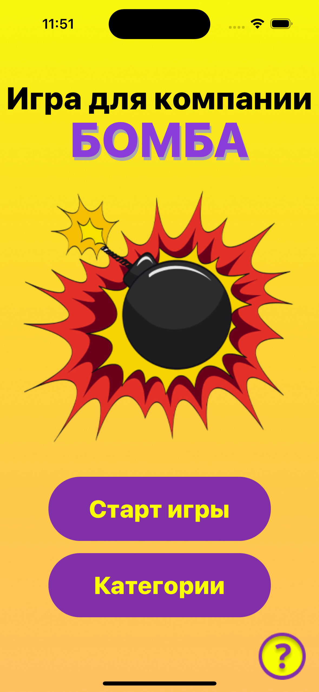

# SM8Bomb
CHALLENGE №1 “БОМБА” (SM 8.0)

### Требования

* проект на Swift 5
* минимальная поддерживаемая iOS – 15
* только iPhone и портретная ориентация экрана
* шрифты стандартные

### Команда
[s9888556](https://github.com/s9888556) Teamleader\
[4Leo](https://github.com/4Leonid)\
[_alex_sam](https://github.com/alexrybachev)\
[_fokusnik](https://github.com/Fokusnik909)\
[misterp966](https://github.com/MrIOSDev)

